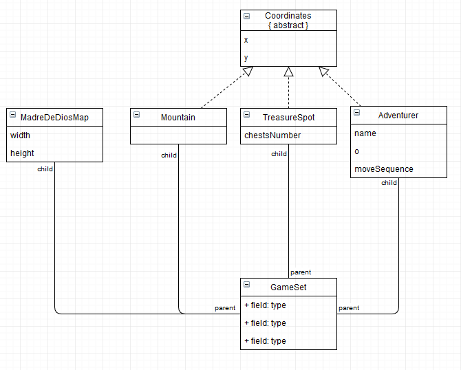
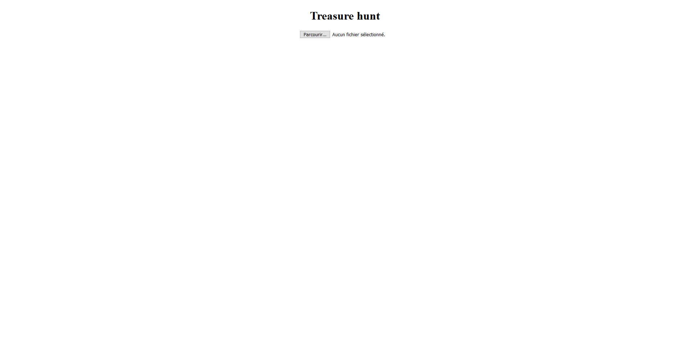
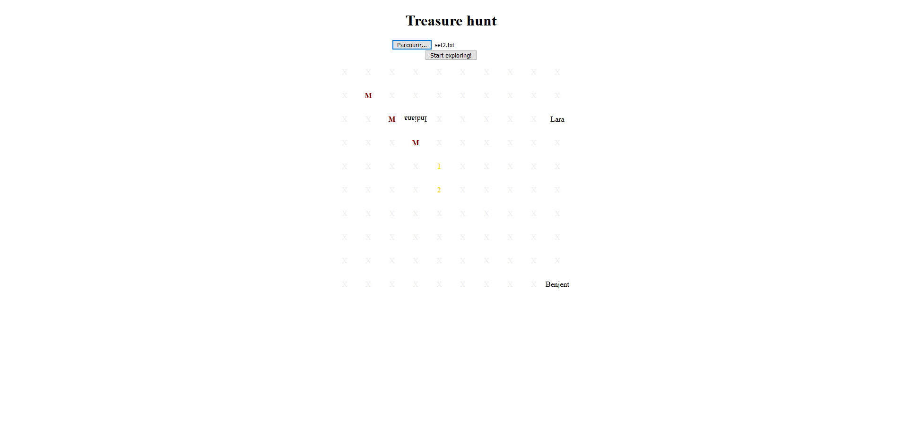
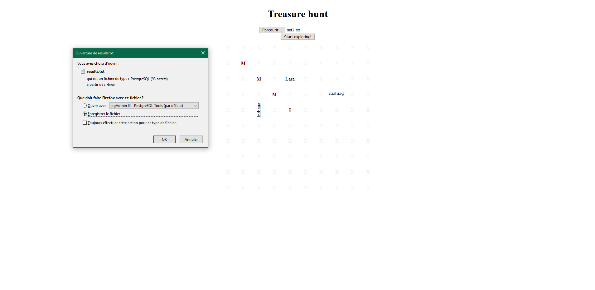
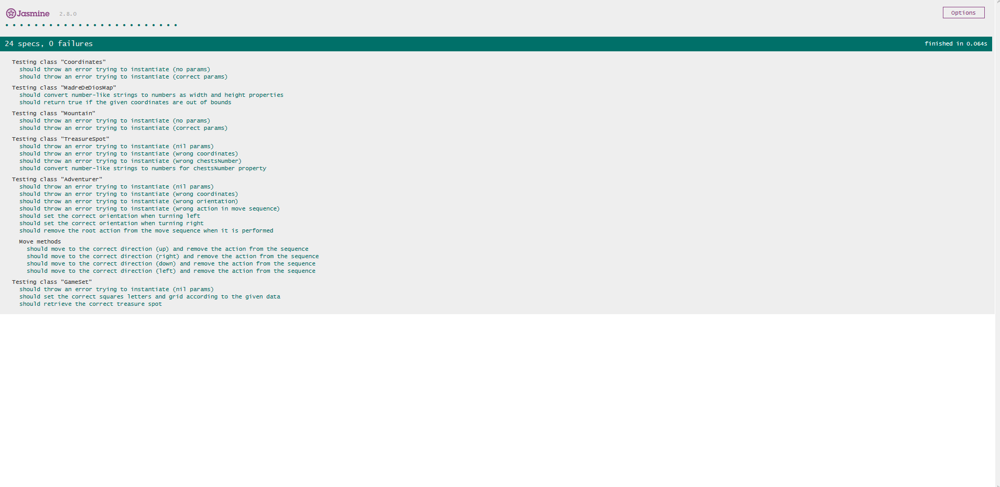

# treasureHunt
Carbon IT test

## Introduction
The goal of this project is to retrieve data from an entry file, move objects from the retrieved data through a grid and then generate an output file. I was given 5 days to develop the project, where I could arrange my time. Beside the 3 instructions (entry file, simulation, output file), I was free to use any technology I wanted.

## Technologies used
For the sake of simplicity and *straight-to-the-point*ness, I did not put up a backend. I use javascript as it is the language I am more at ease with and the project is runnable through a browser (tested on FireFox and Google Chrome).

I use HTML/CSS, Vue.js, Jasmine for unit tests and JSDoc.

## What has been done
Below is a simplified UML of the project:

 "UML"

index.html serves as the entry of the project. Opening this file will lead to the main view with the choice of uploading an entry file. The file upload is handled by a Vue.js component called fileUploader. The rest (grid generation, simulation, output file generation) is handled in the main Vue.js app.

Models have been created respectively for the adventurer, the mountain, the treasure spot and the map (called MadreDeDiosMap to avoid confusion with the Map collection). A GameSet model gathers the instances of these models to create a board for the simulation. The game set can be regarded as the context for the simulation.

Below are the different views when the app is run:

 "Landing page"
 "File upload"
 "Simulation done"

Unit tests have been written for every model.

spec-runner.html serves as the display of test results. Below is the view of the unit test results:

 "Unit testing"

An example of an entry file can be found in the set folder, called set2.txt. Feel free to add your own entry files. When a file is uploaded, it is possible to launch the simulation. Mountains are reprensented by the letter M, passable lands by the letter X, treasure spots by the number of remaining chests, and adventurers by their name. When an adventure is on a treasure spot, the name is hidden to let the chest number appear.

## What I wish I had done if I had more time
1. A more standard project structure

Having a proper src folder with assets subfolder and such, but the size of the project would make it overly rigorous. Still, using VueCLI for instance, would make this test project closer to a real application.

2. Componentize more

Just as the fileUploader, a component in charge of the simulation would be great instead of blankly placing the code in the app.js file. But I prefered focusing on what was asked.

3. Use Vuex and its store

Instead of passing the gameSet as a context to the adventurer methods, a store would be nice to tell if a grid square is free or not. And even, in general, using a store is always worth it.

4. Make the views fancier

I wish I had the time to make a perfect UI, use SCSS and make proper split stylesheets. Sprites could have been used instead of letters and blank grid squares. The bare minimum has been made here.

5. Check the consistency of the user inputs

- Check if the grid is big enough to be a usable grid
- Check if model coordinates do not overlap in the entry file
- Check if some coordinates are out of bounds from the beginning
- Check if the entry file only holds one map (C) and not several
- Check if there are not too many adventurers on the map to make a proper simulation
- Check if an adventurer name is not already used by another

6. Improve tests

A few methods from the Adventurer class are left untested. It could be interesting to use a library that does the *isNil* job for me, but it is preferable to keep the app light considering the context. Integration tests would be fine, and an end-to-end test would perfect to check if the standard use case is left untouched.

7. Make a step-by-step mode